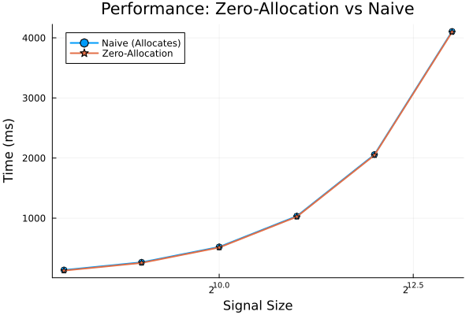

# ScatteringTransforms.jl

[](https://github.com/jbphyswx/ScatteringTransforms.jl/actions)

Fast, generic wavelet scattering transforms in Julia.

## Features

- **1D / 2D / 3D**: signals, images, and volumes with oriented Morlet wavelets.
- **Two outputs**: globally-averaged coefficients (`st(x)`) and the localized (Mallat) field
  `scattering_field(st, x) = (|U_p x| ⋆ φ_J) ↓ s` (their spatial means agree by construction).
- **Correct path structure**: second order over strictly coarser scales, all orientation pairs
  (enumerated once into a `ScatteringTree`).
- **Reduced descriptors**: normalized (`S1/S0`, `S2/S1`), log, and 2D sparsity `s₂₁` /
  anisotropy `s₂₂` (`compute_shape_sparsity`).
- **Pluggable spectral backend**: dependency-free direct-sum default; `using FFTW` switches on
  an `O(N log N)` fast path automatically (`spectral = :auto | :direct | :fftw`).
- **Batching & threading**: `scattering_batch` reuses one plan/workspace; `using OhMyThreads`
  enables `scattering_batch(ThreadedCPU(), …)`.
- **Generic & type-stable**: `Float32`/`Float64`, autodiff-friendly, GPU-array-ready hot path,
  in-place `!` methods over pre-allocated buffers.

## Quick Start

```julia
using ScatteringTransforms

# 1D Scattering
N = 1024
signal = randn(N)
st = ScatteringTransform1D(N, 8; Q=1, max_order=2)
coeffs = st(signal)

@show coeffs.S0  # 0th order (average)
@show coeffs.S1  # 1st order (scale amplitudes)
@show coeffs.S2  # 2nd order (scale interactions)

# 2D Scattering
image = randn(256, 256)
st2d = ScatteringTransform2D((256, 256), 4; L=8, max_order=2)
coeffs_2d = st2d(image)

# 3D volumetric scattering
st3d = ScatteringTransform3D((32, 32, 32), 3; n_orient=6, max_order=2)
coeffs_3d = st3d(randn(32, 32, 32))

# Localized (Mallat) field, reduced descriptors, batching
field  = scattering_field(st, signal)              # per-path low-passed, subsampled maps
norm   = normalized_coefficients(coeffs)           # s1 = S1/S0, s2 = S2/S1
batch  = scattering_batch(st, randn(N, 100))       # (coeffs × 100), one plan reused

using FFTW         # → automatic O(N log N) fast path
using OhMyThreads  # → scattering_batch(ThreadedCPU(), st, X)
```

## Wavelet & Scattering Visualizations

Here are the generated figures showcasing the 1D/2D wavelet tiling and scattering transform outputs:

### 1. 1D Wavelet Scattering
Decomposition of a 1D pink noise signal with a low-frequency oscillation, showing first-order ($S_1$) and second-order ($S_2$) coefficients:


### 2. Frequency Tiling (Morlet Filter Bank)
The frequency response of the 1D Morlet filter bank showing optimal overlapping frequency coverage across multiple scales:


### 3. 2D Wavelet Scattering
Applying a 2D scattering transform to a multi-scale fractal texture, showing the orientation-scale decomposition and second-order coefficients:


### 4. Zero-Allocation Streaming Benchmarks
Comparing the execution time of the zero-allocation API against the standard allocating API across different signal sizes:



## Documentation

- [Documentation](https://jbphyswx.github.io/ScatteringTransforms.jl/dev/)
- [Theory](docs/src/theory.md) - Mathematical background
- [API Reference](docs/src/api.md) - Function documentation

## Examples

See the [examples/](examples/) directory:

- `basic_usage.jl` - Getting started with 1D and 2D scattering
- `zero_allocation_streaming.jl` - High-performance streaming for large datasets
- `gpu_acceleration.jl` - GPU-ready type system demonstration

Run examples:
```bash
cd examples
julia --project=. -e 'using Pkg; Pkg.instantiate()'
julia --project=. basic_usage.jl
```

## Zero-Allocation Streaming

For large datasets (e.g., ocean data), use the in-place API:

```julia
st = ScatteringTransform1D(N, 8; Q=1, max_order=2)
coeffs = ScatteringCoefficients1D(length(st.filter_bank.wavelets), Float64)

for slice in dataset
    coeffs = scattering_transform!(coeffs, st, slice)
    process(coeffs)
end
```

## References

- Mallat (2012): Group invariant scattering. *Comm. Pure Appl. Math.*
- Bruna & Mallat (2013): Invariant Scattering Convolution Networks. *IEEE PAMI*
- Cheng & Ménard (2021): [How to quantify fields or textures?](https://arxiv.org/pdf/2112.01288)
- Related packages: [scattering_transform](https://github.com/SihaoCheng/scattering_transform), [ScatteringTransform.jl](https://github.com/dsweber2/ScatteringTransform.jl)

## Citation

```bibtex
@software{scatteringtransforms_jl,
  author = {Benjamin, Jordan},
  title = {ScatteringTransforms.jl: Fast wavelet scattering in Julia},
  url = {https://github.com/jbphyswx/ScatteringTransforms.jl}
}
```
