# ScatteringTransforms.jl

[](https://github.com/jbphyswx/ScatteringTransforms.jl/actions/workflows/CI.yml)
[](https://jbphyswx.github.io/ScatteringTransforms.jl/dev/)
[](https://codecov.io/gh/jbphyswx/ScatteringTransforms.jl)

Fast, generic wavelet scattering transforms in Julia.

**[Documentation](https://jbphyswx.github.io/ScatteringTransforms.jl/dev/)** —
[API reference](https://jbphyswx.github.io/ScatteringTransforms.jl/dev/api/) ·
[theory](https://jbphyswx.github.io/ScatteringTransforms.jl/dev/theory/)

## Features

- **1D / 2D / 3D**: signals, images, and volumes with oriented Morlet wavelets.
- **Two outputs**: globally-averaged coefficients (`st(x)`) and the localized (Mallat) field
  `scattering_field(st, x) = (|U_p x| ⋆ φ_J) ↓ s` (their spatial means agree by construction).
- **Correct path structure**: second order over strictly coarser scales, all orientation pairs
  (enumerated once into a `ScatteringTree`).
- **Reduced descriptors**: normalized (`S1/S0`, `S2/S1`), log, and 2D sparsity `s₂₁` /
  anisotropy `s₂₂` (`compute_shape_sparsity`).
- **Reconstruction**: exact linear wavelet-frame inverse (`wavelet_transform`/`iwavelet`), phase
  retrieval (`reconstruct_phase`), and gradient-descent `synthesize` from coefficients
  (DifferentiationInterface extension; any `ADTypes` backend, e.g. `AutoMooncake`).
- **Monogenic (Riesz) scattering**: `MonogenicScattering` (1D/2D/3D) with the rotation-covariant
  monogenic amplitude + continuous orientation/phase (`monogenic_components`); on S²,
  `spherical_monogenic_scattering` (amplitude via the spin-0 Bochner identity) plus
  `spherical_monogenic_components` for pointwise orientation/phase (spin-1 Riesz vector, dependency-free
  via the surface gradient, or NUFSHT's spin-weighted synthesis when loaded).
- **Grid-support matrix**: Cartesian × spherical, on uniform/structured and nonuniform/scattered
  sampling — gridded `ScatteringTransform{1,2,3}D` (FFT), scattered-planar `scattered_planar_scattering`
  (exact direct NUDFT), structured-sphere `structured_spherical_scattering` (exact direct SHT), and
  scattered-sphere `spherical_scattering` (exact direct SHT). **Every cell has an in-core,
  dependency-free default**; `using FINUFFT` / `using NUFSHT` / `using FastSphericalHarmonics` add
  faster paths selected via the `spectral` keyword.
- **Pluggable spectral backend**: dependency-free direct-sum default; `using FFTW` switches on
  an `O(N log N)` fast path automatically
  (`spectral = AutoSpectralBackend() | DirectSumSpectralBackend() | FFTSpectralBackend()`).
- **Batching & threading**: `scattering_batch` reuses one plan/workspace across the batch, on every
  surface — gridded 1D/2D/3D, scattered planar, and the sphere; `using OhMyThreads` enables
  `scattering_batch(ThreadedBackend(), …)`, which is bit-identical to serial.
- **Multi-resolution second order**: `SubsampledScattering1D/2D/3D` run the order-2 cascade on a
  decimated grid, converging to the exact transform as `oversampling` grows.
- **Vendor-neutral GPU**: `using KernelAbstractions, AbstractFFTs` + a device backend (e.g.
  `using CUDA`) gives a device-resident transform via `GPUBackend(CUDA.CUDABackend())` and a
  batched-throughput `scattering_batch(gpu, st, X)` — CUDA/ROCm/oneAPI/Metal, validated on `KA.CPU()`.
  Covers the gridded 1D/2D/3D surfaces and the scattered-planar one. On scattered points everything
  downstream of the points follows their array type — bank, buffers, cascade — so there is one
  cascade rather than a device copy of it, and only the NUFFT is bound per vendor: `NonuniformFFTs`
  is KernelAbstractions-native and runs on any of them, `cuFINUFFT` is bound for CUDA. The
  vendor-neutral chain is exercised on `KA.CPU()`; the CUDA bindings themselves are not covered by
  CI, which has no device. Structured-grid spherical scattering is host-only, since
  `FastSphericalHarmonics` has no device path.
- **Generic & type-stable**: `Float32`/`Float64`, autodiff-friendly, GPU-array-ready hot path,
  in-place `!` methods over pre-allocated buffers.

## Quick Start

```julia
using ScatteringTransforms

# 1D Scattering
N = 1024
signal = randn(N)
st = ScatteringTransform1D(N, 8; Q=1, max_order=2)
coeffs = st(signal)

@show coeffs.S0  # 0th order (average)
@show coeffs.S1  # 1st order (scale amplitudes)
@show coeffs.S2  # 2nd order (scale interactions)

# 2D Scattering
image = randn(256, 256)
st2d = ScatteringTransform2D((256, 256), 4; L=8, max_order=2)
coeffs_2d = st2d(image)

# 3D volumetric scattering
st3d = ScatteringTransform3D((32, 32, 32), 3; n_orient=6, max_order=2)
coeffs_3d = st3d(randn(32, 32, 32))

# Localized (Mallat) field, reduced descriptors, batching
field  = scattering_field(st, signal)              # per-path low-passed, subsampled maps
norm   = normalized_coefficients(coeffs)           # s1 = S1/S0, s2 = S2/S1
batch  = scattering_batch(st, randn(N, 100))       # (coeffs × 100), one plan reused

using FFTW         # → automatic O(N log N) fast path
using OhMyThreads  # → scattering_batch(ThreadedBackend(), st, X)
```

## Why scattering? (the headline result)

Two signals can have **identical power spectra** yet very different structure. The scattering
transform tells them apart: an intermittent signal (sparse bursts) has strong **cross-scale
coupling** `S₂/S₁`, while its phase-randomized Gaussian surrogate does not — even though their
power spectra (and first-order `S₁`) are the same.

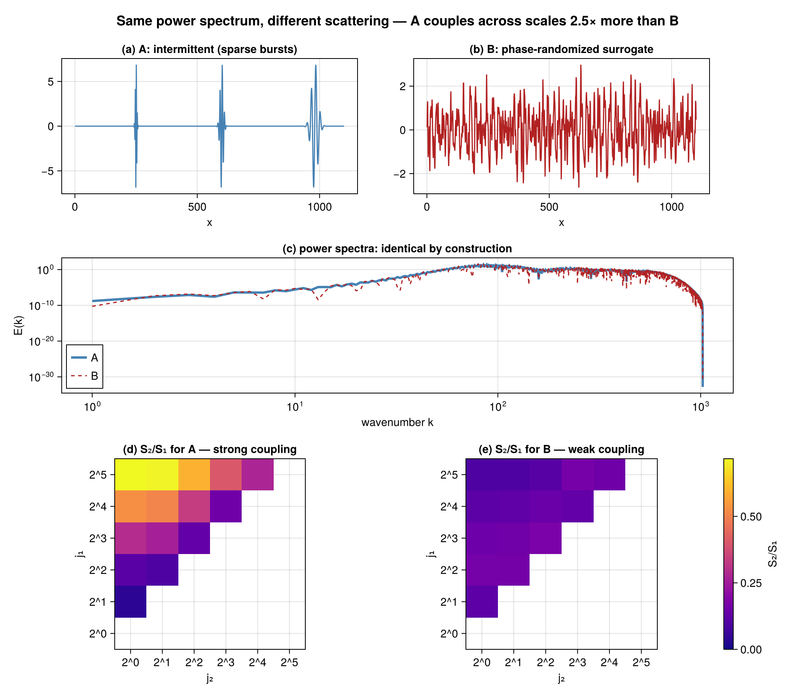

## Visualizations

### Filter bank — a tight frame
1D Morlet filter bank in the frequency domain. The Littlewood–Paley sum `|φ|² + Σⱼ|ψⱼ|²` is
flat at **1** (a tight frame ⇒ the transform is non-expansive — no frequency is amplified).

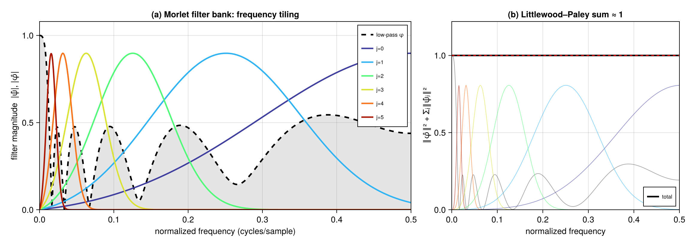

### 1D scattering
A 1/f (turbulent) signal with its `S₀`, first-order `S₁(j)`, and second-order `S₂(j₁,j₂)`
(only admissible strictly-coarser scale pairs are populated).

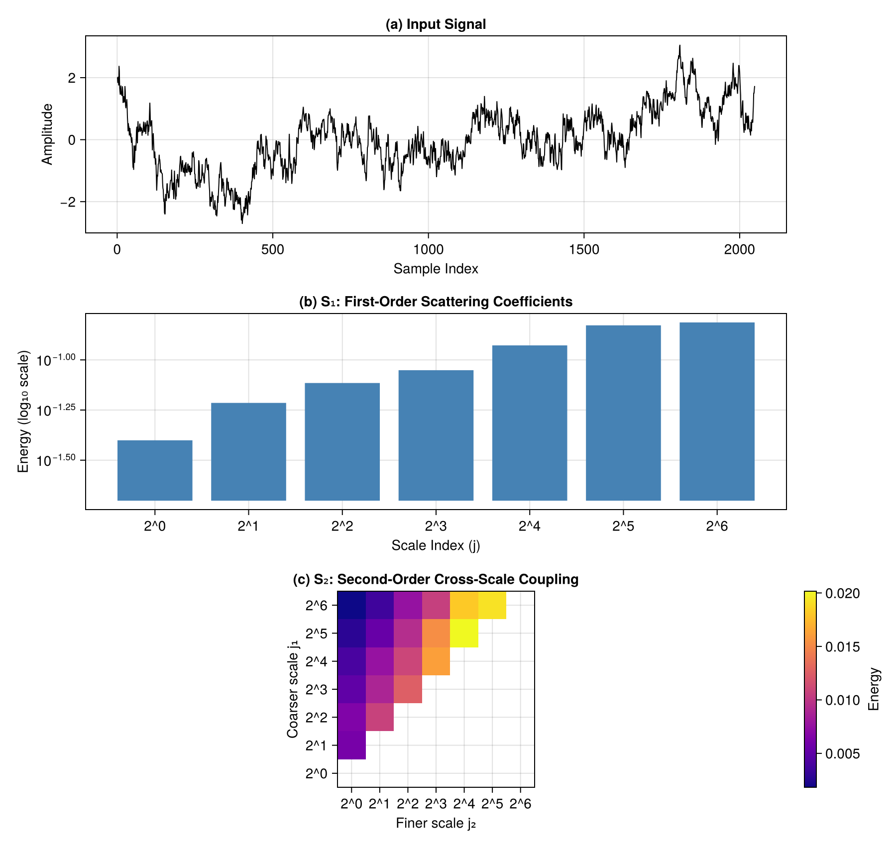

### 2D scattering
A turbulent 2D field with `S₁` over scale × orientation and `S₂` over wavelet pairs. The `S₂`
panel is a `(J·L)²` matrix whose only populated blocks are **strictly coarser scale pairs**
(all orientation pairs); the same-scale diagonal blocks are empty by construction.

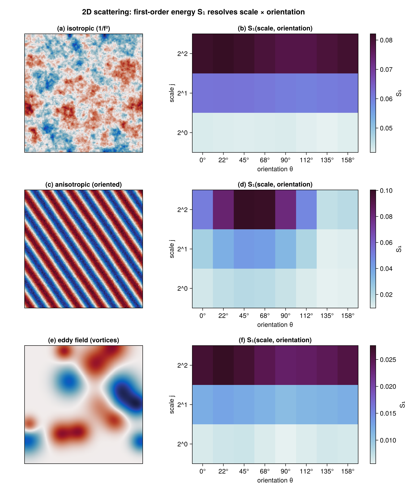

### Localized (Mallat) field
`scattering_field` returns `S_p x = (|U_p x| ⋆ φ_J)↓` per path — energy localized in **scale
and space** (here: two bursts at different scales light up different rows/positions).

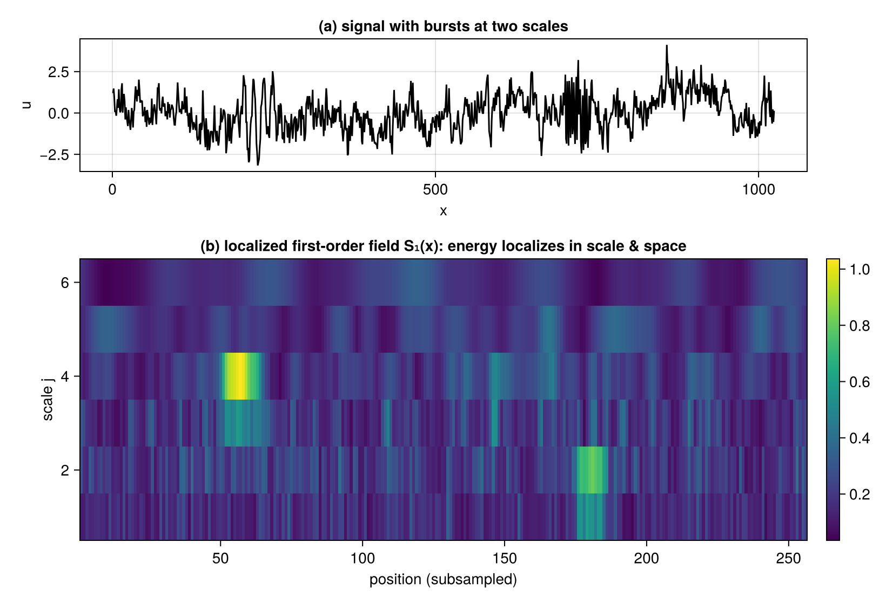

### Reduced descriptors — anisotropy
The shape reduction `s₂₂` (second angular harmonic of `S₂`) cleanly separates an oriented
texture from an isotropic one.

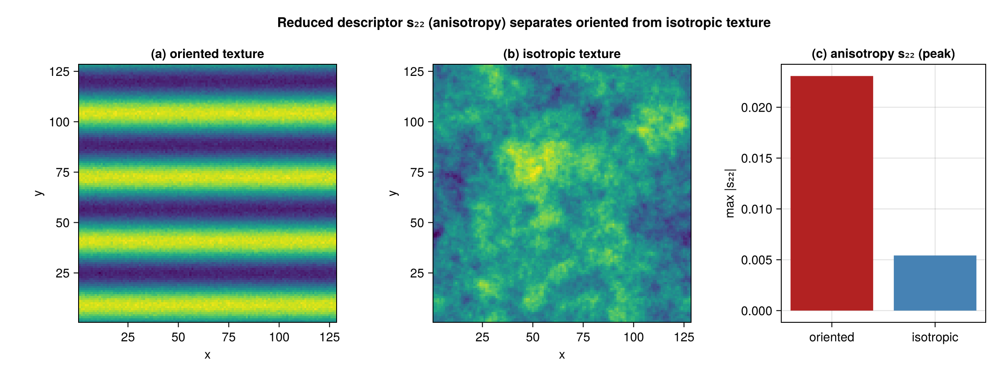

### Reconstruction & synthesis
The complex (pre-modulus) wavelet layer is exactly invertible (`iwavelet`, machine precision);
from the scattering *coefficients*, `synthesize` (DifferentiationInterface + an AD backend)
descends `‖S(x̂)−S(x)‖²` to draw a new sample with matching multiscale statistics — 1D and 2D.

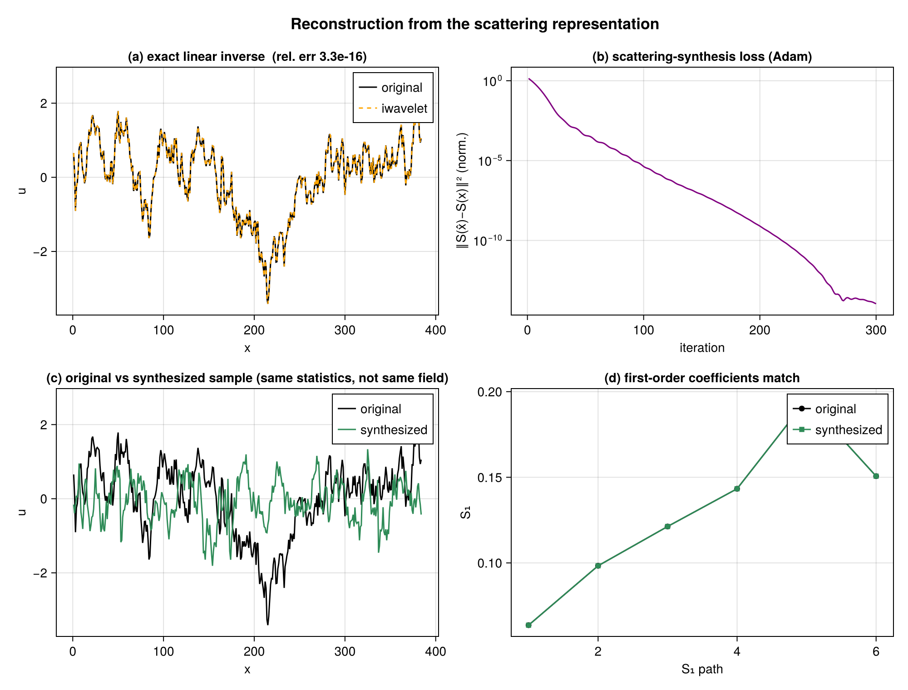
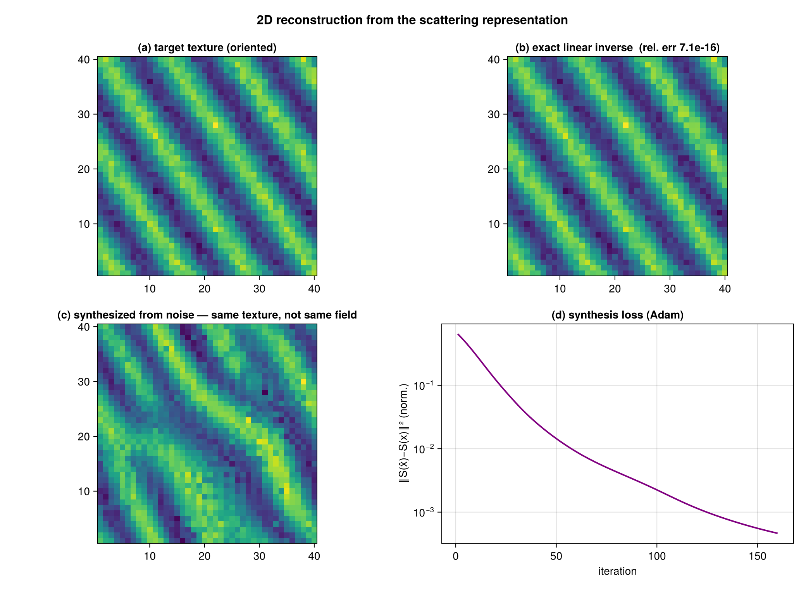

### Monogenic (Riesz) scattering
The rotation-covariant monogenic amplitude replaces the oriented modulus; `monogenic_components`
recovers the local amplitude envelope and a **continuous** orientation (a radial pinwheel here),
not quantized orientation bins.

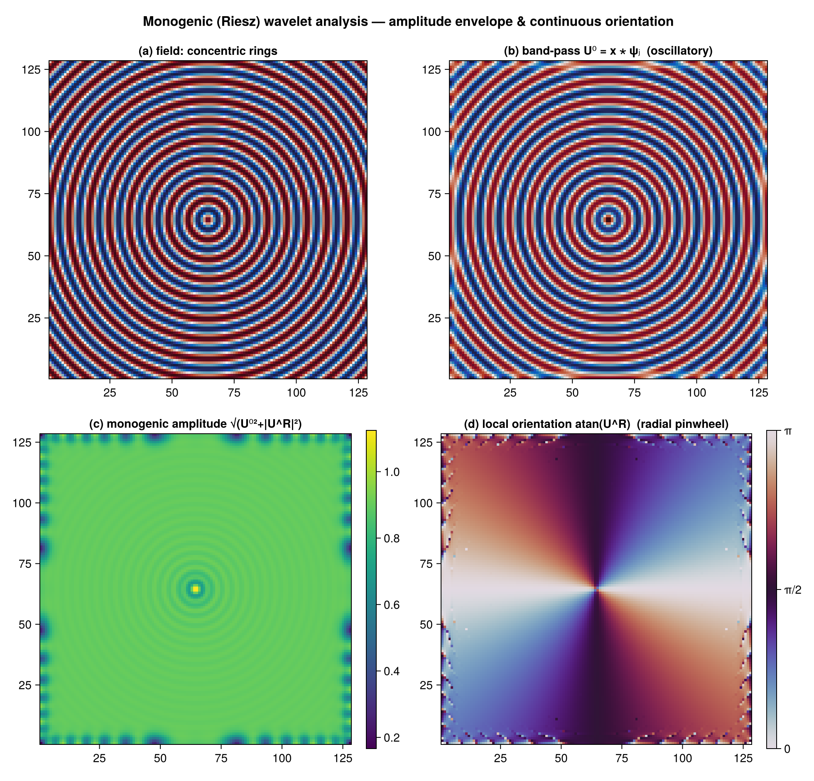

### Nonuniform / scattered planar grids
Off-lattice / gappy planar data (scattered `(x, y)` points) is scattered onto a uniform Fourier mode
grid by a nonuniform DFT (`scattered_planar_scattering`), where the ordinary Morlet wavelet bank lives;
on a uniform grid it reproduces the gridded FFT transform exactly, and `solve=true` gives the exact
band-limited (CG least-squares) inversion for irregular sampling. The default is an in-core exact direct
NUDFT (no dependencies); `using FINUFFT` enables the faster NUFFT path.

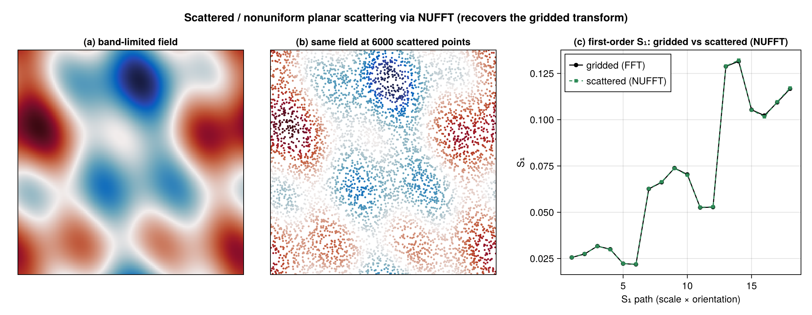

### Spherical scattering
On S², both **scattered points** (`spherical_scattering`; in-core direct SHT by default, NUFSHT fast
path with `using NUFSHT`) and a **structured** Clenshaw–Curtis grid (`structured_spherical_scattering`,
via the fast SHT in FastSphericalHarmonics) give matching multi-scale coefficients:

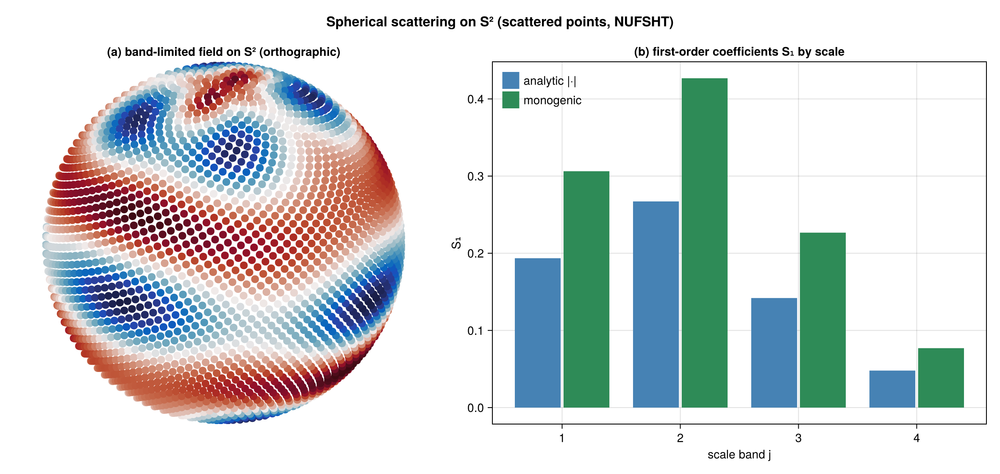
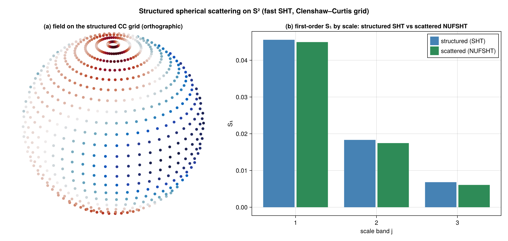

The monogenic *amplitude* computes the spin-1 Riesz energy from spin-0 transforms via a Bochner
identity (no spin-1 synthesis needed); pointwise orientation/phase (`spherical_monogenic_components`)
synthesizes the actual spin-1 Riesz tangent vector on S².

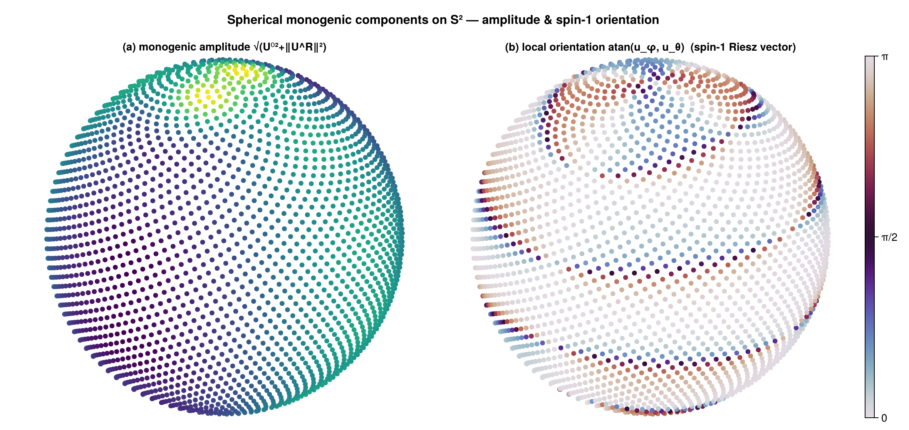

### Spectral backends
The in-core direct-sum default is dependency-free but `O(N²)`; loading `FFTW` switches on an
`O(N log N)` fast path automatically (≈100–1000× faster), with identical results.

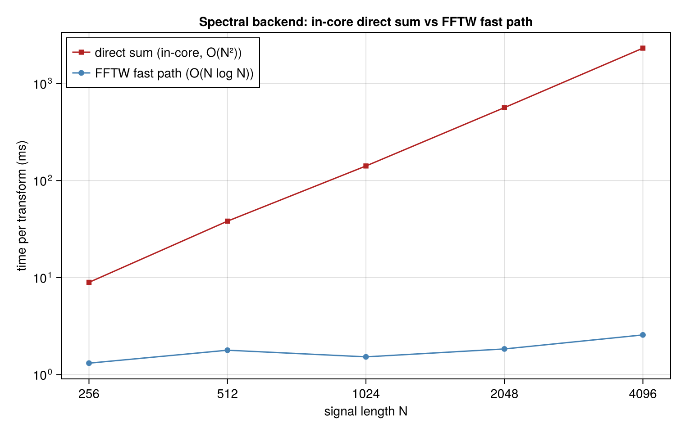

## Documentation

- [Documentation](https://jbphyswx.github.io/ScatteringTransforms.jl/dev/)
- [Theory](docs/src/theory.md) - Mathematical background
- [API Reference](docs/src/api.md) - Function documentation

## Examples

See the [examples/](examples/) directory:

- `basic_usage.jl` - 1D/2D/3D scattering, localized field, reductions, batching/threading
- `zero_allocation_streaming.jl` - High-performance streaming for large datasets
- `backends.jl` - spectral (direct-sum vs FFTW) and compute (serial/threaded/GPU) backends
- `synthesis_and_inverse.jl` - exact inverse, phase retrieval, and coefficient synthesis
- `monogenic.jl` - monogenic (Riesz) scattering: amplitude envelope + continuous orientation

Run examples:
```bash
cd examples
julia --project=. -e 'using Pkg; Pkg.instantiate()'
julia --project=. basic_usage.jl
```

## Zero-Allocation Streaming

For large datasets (e.g., ocean data), use the in-place API:

```julia
st = ScatteringTransform1D(N, 8; Q=1, max_order=2)
coeffs = ScatteringCoefficients1D(length(st.filter_bank.wavelets), Float64)

for slice in dataset
    coeffs = scattering_transform!(coeffs, st, slice)
    process(coeffs)
end
```

## References

- Mallat (2012): Group invariant scattering. *Comm. Pure Appl. Math.*
- Bruna & Mallat (2013): Invariant Scattering Convolution Networks. *IEEE PAMI*
- Cheng & Ménard (2021): [How to quantify fields or textures?](https://arxiv.org/pdf/2112.01288)
- Related packages: [scattering_transform](https://github.com/SihaoCheng/scattering_transform), [ScatteringTransform.jl](https://github.com/dsweber2/ScatteringTransform.jl)

## Citation

```bibtex
@software{scatteringtransforms_jl,
  author = {Benjamin, Jordan},
  title = {ScatteringTransforms.jl: Fast wavelet scattering in Julia},
  url = {https://github.com/jbphyswx/ScatteringTransforms.jl}
}
```
