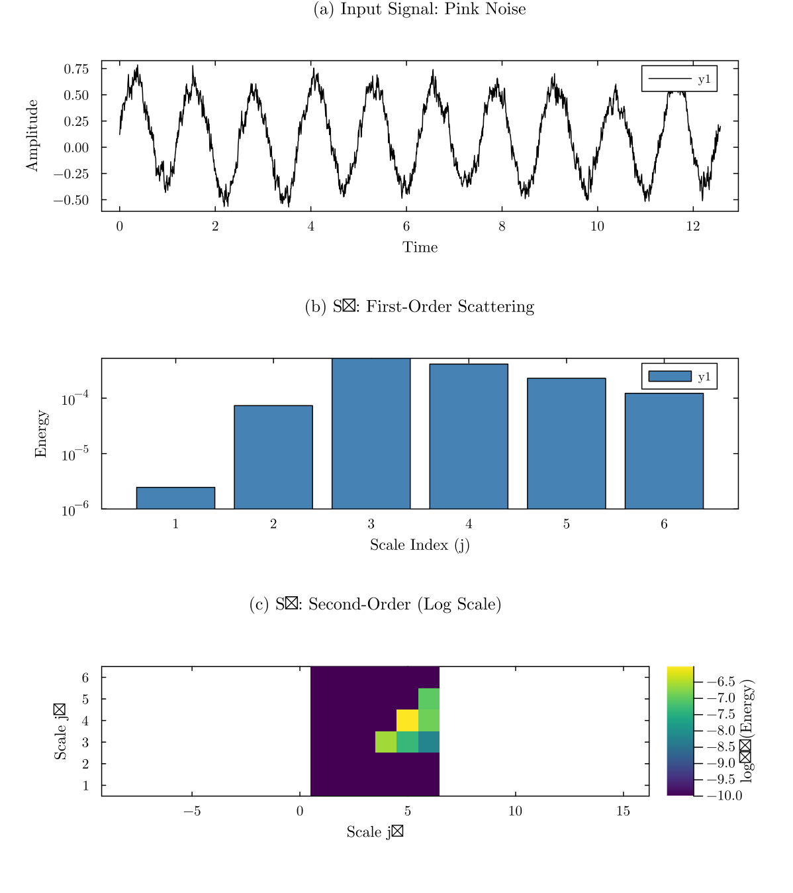
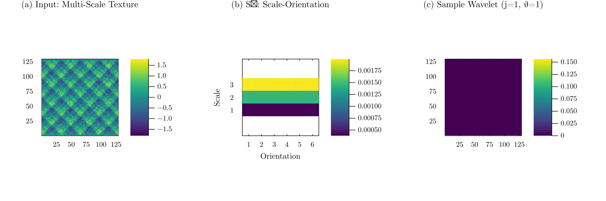
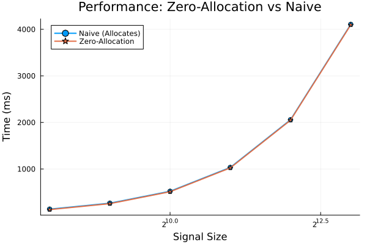

# ScatteringTransforms.jl

A fast, generic Julia implementation of the wavelet scattering transform for 1D signals and 2D images.

## Features

- **Fully generic**: Works with `Float32`, `Float64`, and automatic differentiation (ForwardDiff, Zygote)
- **GPU-ready**: Compatible with CUDA arrays (`CuVector`, `CuMatrix`)
- **Zero-allocation**: In-place operations with pre-allocated buffers for high-performance streaming
- **Type-stable**: All functions are fully type-inferred for optimal performance

## Quick Start

### 1D Scattering


*Example: 1D signal with first-order (S1) and second-order (S2) scattering coefficients.*

```julia
using ScatteringTransforms

# Create a signal
N = 1024
signal = randn(N)

# Build scattering transform
st = ScatteringTransform1D(N, 8; Q=1, max_order=2)

# Compute coefficients
coeffs = st(signal)

# Access results
@show coeffs.S0          # 0th order (average)
@show coeffs.S1          # 1st order (scale amplitudes)
@show coeffs.S2          # 2nd order (scale interactions)
```

### 2D Scattering


*Example: 2D image with first-order and second-order scattering coefficients.*

```julia
using ScatteringTransforms

# Create an image
image = randn(256, 256)

# Build 2D scattering transform with oriented wavelets
st2d = ScatteringTransform2D((256, 256), 4; L=8, max_order=2)

# Compute coefficients
coeffs_2d = st2d(image)
```

## Zero-Allocation Streaming


*Performance: Zero-allocation approach scales to TB-size datasets with minimal memory pressure.*

For processing large datasets (e.g., 20TB of ocean data), use the in-place API:

```julia
# Pre-allocate once
st = ScatteringTransform1D(N, 8; Q=1, max_order=2)
coeffs = ScatteringCoefficients1D(length(st.filter_bank.wavelets), Float64; compute_S2=true)

# Stream through data with zero allocations
for slice in dataset
    coeffs = scattering_transform!(coeffs, st, slice)
    process(coeffs)
end
```

## Documentation

- [Theory](theory.md) - Mathematical background on scattering transforms
- [API Reference](api.md) - Complete function and type documentation

## Citation

If you use this package in your research, please cite:

```bibtex
@software{scatteringtransforms_jl,
  author = {Benjamin, Jordan},
  title = {ScatteringTransforms.jl: Fast wavelet scattering in Julia},
  url = {https://github.com/jbphyswx/ScatteringTransforms.jl}
}
```
