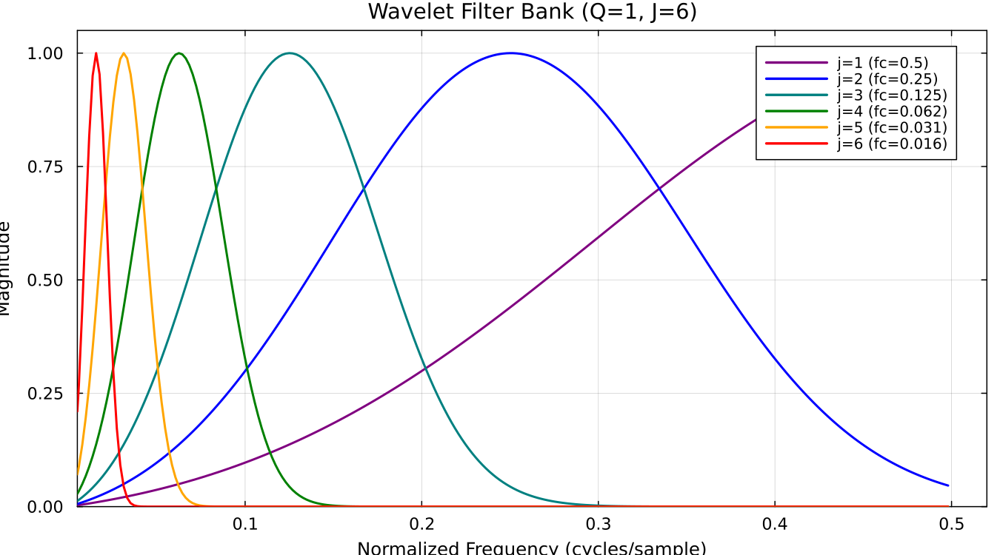

# Theory of Scattering Transforms

The scattering transform provides a powerful statistical vocabulary to quantify textures and structures in signals and images.

## Overview

The scattering transform is a cascade of wavelet convolutions and modulus operations that provides:
- **Translation invariance**: Invariant to shifts in the input
- **Stability to deformations**: Robust to small perturbations
- **Information preservation**: Captures higher-order statistics beyond power spectra

## Mathematical Definition

### 1D Scattering

Given a signal $x(t)$, the scattering coefficients are defined recursively:

**0th order**:
```math
S_0 x = \int x(t) \, dt
```

**1st order**:
```math
S_1[j] = \int |x \star \psi_j(t)| \, dt
```

where $\psi_j$ is a wavelet at scale $j$.

**2nd order**:
```math
S_2[j_1, j_2] = \int ||x \star \psi_{j_1}| \star \psi_{j_2}(t)| \, dt
```

### 2D Scattering

For images, we use oriented Morlet wavelets:

```math
\psi_{j,\theta}(u) = 2^{-2j} \psi(2^{-j} r_{-\theta} u)
```

where $r_{-\theta}$ is rotation by angle $-\theta$.

## Properties

### Translation Invariance

The spatial averaging (integration) makes $S_0$, $S_1$, and $S_2$ invariant to translations.

### Lipschitz Continuity

Small deformations $x_\tau(t) = x(t - \tau(t))$ with $|\tau'(t)| < 1$ satisfy:

```math
\|S_J x - S_J x_\tau\| \leq C \|x\| \sup_t |\tau(t)| 2^{-J}
```

This provides stability to small warps and deformations.

## Filter Bank Design


*Morlet wavelet filter bank in the frequency domain, showing multiple scales.*

### Morlet Wavelets

The wavelets are defined in the Fourier domain:

```math
\hat{\psi}(\omega) = C \cdot (e^{-(\omega - \xi)^2 / 2\sigma^2} - e^{-\xi^2/2\sigma^2} e^{-\omega^2/2\sigma^2})
```

where:
- $\xi$ is the center frequency
- $\sigma$ controls bandwidth
- The second term ensures zero mean

### Averaging Filter

A low-pass filter $\phi$ is used for spatial averaging:

```math
S_0 x = x \star \phi
```

## Applications

- **Texture classification**: Distinguishing different materials in images
- **Audio analysis**: Musical genre classification, timbre analysis
- **Turbulence**: Characterizing intermittency in fluid flows
- **Oceanography**: Quantifying submesoscale variability in sea surface height

## References

- Mallat, S. (2012). Group invariant scattering. *Communications in Pure and Applied Mathematics*, 65(10), 1331-1398.
- Bruna, J., & Mallat, S. (2013). Invariant scattering convolution networks. *IEEE PAMI*, 35(8), 1872-1886.
- Cheng, T. Y., & Ménard, B. (2021). How to quantify fields or textures? A guide to the scattering transform.
